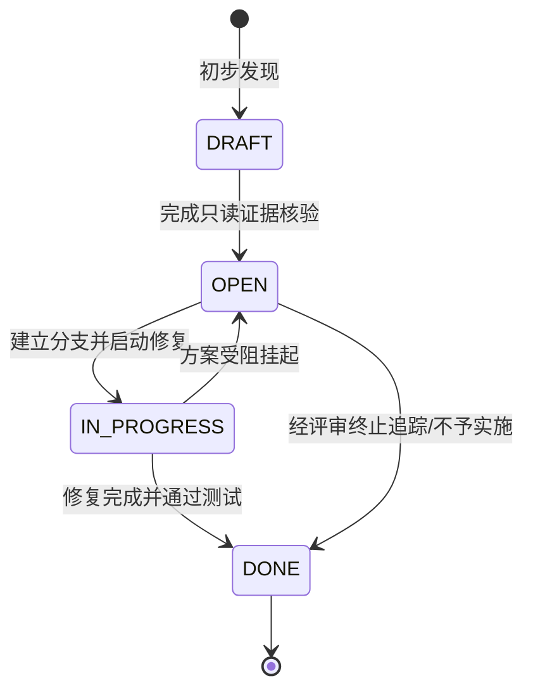

# MODO 已知问题（KI）管理与流转规范指南

更新日期：2026-09-23
状态：现行
适用范围：MODO 仓库内所有缺陷登记、技术债务管理与治理闭环

---

## 一、 为什么采用仓内本地 KI 体系？

对标成熟开源工程治理实践（如邻近的 `mod` 项目），MODO 确立了**仓内 Markdown 本地追踪为主**的管理模式，其核心优势包括：
1. **单一真理源**：问题、证据与源码同版本控制，不依赖任何第三方闭源 SaaS。
2. **原子更新**：修复代码提交与 Issue 状态流转在同一次 Git 提交中闭环，杜绝状态漂移。
3. **证据驱动**：每个条目要求精准的代码行号与日志证据，提升工程治理可信度。
4. **Agent 友好**：AI 编程助手可直接以只读模式索引并按规范闭环更新。

---

## 二、 核心状态机定义

条目的生命周期严格限定在以下 4 种状态，禁止使用其他同义词：

- **`DRAFT`（草案）**：初步观察到的疑似问题，正在进行代码审阅或尝试复现，证据尚不充分。
- **`OPEN`（待处理）**：已完成代码级证据定位，确认属于明确缺陷或技术债务，已完成独立建档并在看板登记。
- **`IN-PROGRESS`（处理中）**：已有明确治理方案，正在实施代码改写或编写针对性测试用例。
- **`DONE`（已完成）**：代码改写完成、测试通过、完成定义全部勾选，并在同一次提交中同步更新看板。

---

## 三、 编号与命名规则

1. **唯一编号**：采用 `KI-xxx` 格式（如 `KI-001`, `KI-002`），编号单调递增，已废弃或已关闭的编号永不回收复用。
2. **文件名命名**：`docs/issues/KI-{编号}-{中英文简短主题}.md`，如 `KI-001-敏感资产泄露与生产节点IP暴露.md`。

---

## 四、 登记与闭环操作流程

### 1. 发现新问题
1. 使用只读命令定位代码行号与异常日志。
2. 复制 `docs/development/TEMPLATE-KI.md` 到 `docs/issues/KI-xxx-主题.md` 并填写完整。
3. 在 `docs/KNOWN-ISSUES.md` 的“活跃问题”表格中追加对应行。
4. 提交 Git 变更（如 `docs: register KI-013 ...`）。

### 2. 修复并闭环
1. 在修复代码的分支或工作区中完成源码修复与单元测试编写。
2. 打开对应的 `docs/issues/KI-xxx.md`，将状态改为 `DONE`，更新日期改为当前日期，勾选完成定义中所有已达成条目。
3. 在 `docs/KNOWN-ISSUES.md` 中将该行条目移动至“已关闭问题”表格，状态改为 `DONE`。
4. 将代码修改、测试文件与文档变更**打包在同一个 Git 提交中**（如 `fix: resolve db missing views (KI-002)`）。
